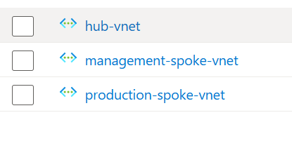
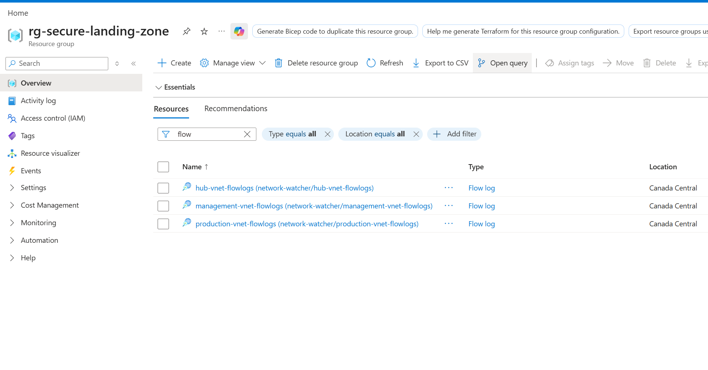
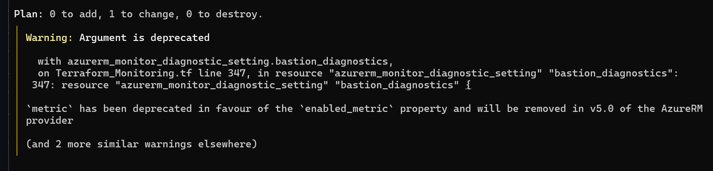

# Azure Secure Landing Zone – Terraform Implementation

## Overview

This project demonstrates the deployment of a secure Azure landing zone using Infrastructure as Code (IaC) with Terraform. The environment follows a hub-spoke architecture and integrates security, monitoring, backup, and network segmentation principles aligned with Azure best practices.

The project was built to strengthen practical skills related to Azure administration (AZ-104), cloud networking, monitoring, and secure infrastructure deployment.

## Architecture

The environment uses a hub-spoke topology:

* Hub Virtual Network for shared services
* Production Spoke Network
* Management Spoke Network
* Azure Bastion for secure administrative access
* Segmented subnets with Network Security Groups
* Virtual Network Peering between hub and spokes

### Network Topology

## Infrastructure Components

### Networking

* Hub-Spoke Virtual Network Architecture
* Virtual Network Peering
* Multiple segmented subnets
* Network Security Groups (NSGs)
* Azure Bastion deployment
* Private networking principles

### Compute

* Linux Virtual Machine deployment
* Dedicated network interfaces
* SSH access management

### Monitoring & Logging

* Azure Network Watcher
* VNET Flow Logs
* Log Analytics Workspace
* Diagnostic Settings
* Traffic Analytics integration

### Backup & Recovery

* Recovery Services Vault
* VM Backup Policies
* Protected workloads

### Storage

* Storage Account deployment
* Logging container creation

## Terraform Structure

Terraform_main.tf
Terraform_Network.tf
Terraform_Security.tf
Terraform_VM.tf
Terraform_Monitoring.tf
Terraform_Backup.tf
Terraform_Storage.tf
Terraform_Bastion.tf
Terraform_Variables.tf

## Deployment Process

Initialize Terraform:
terraform init

Validate configuration:
terraform validate

Review changes:
terraform plan

Deploy infrastructure:
terraform apply

## Azure Resources Deployed

### Resource Group Overview

### Virtual Networks

### Monitoring Configuration

### Terraform Validation

## Skills Demonstrated

* Azure Administration (AZ-104)
* Infrastructure as Code (Terraform)
* Hub-Spoke Network Architecture
* Azure Security Controls
* Monitoring and Logging
* Backup and Recovery
* Cloud Networking
* Infrastructure Automation
* Troubleshooting and Modernization of Azure Services

## Lessons Learned

* Migrated from deprecated NSG Flow Logs to VNET Flow Logs
* Managed Terraform state consistency
* Resolved provider deprecations
* Implemented secure network segmentation
* Applied monitoring best practices

## Author

Created by Ulrich Kemassi

# azure-secure-landing-zone with Terraform
## Project Description

## Architecture diagram

## Author

Ulrich Kemassi
Cloud & Cybersecurity Enthusiast
