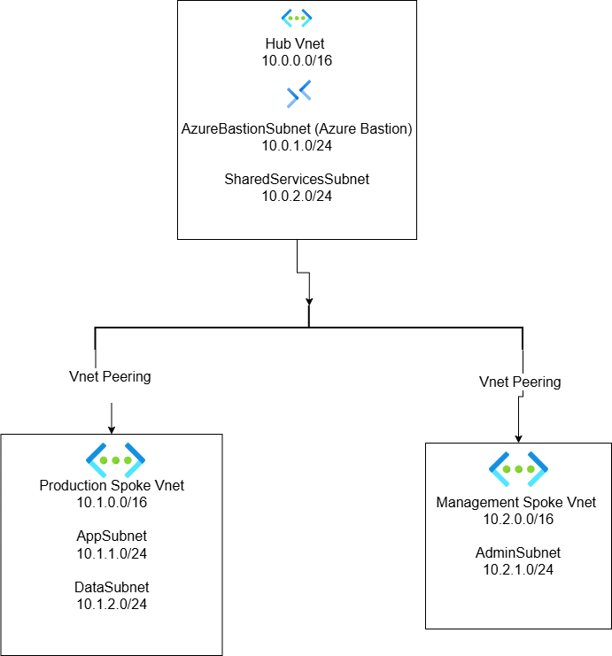
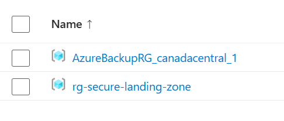
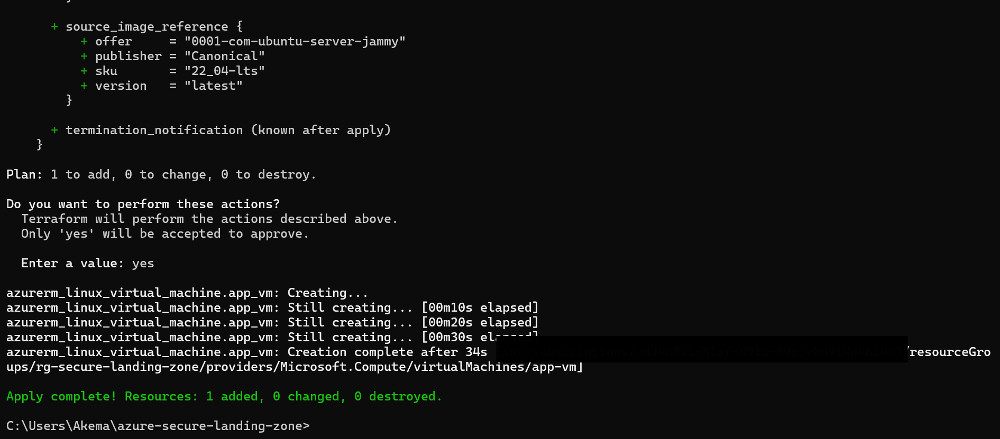
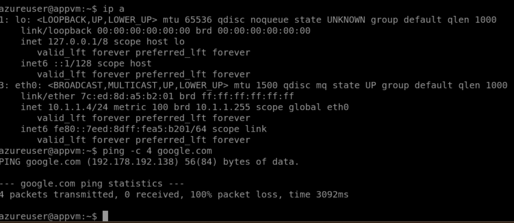
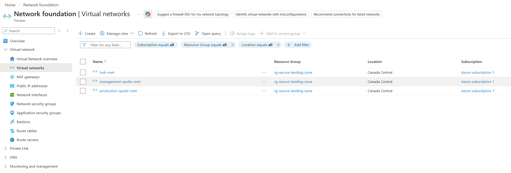

# azure-secure-landing-zone with Terraform
## Project Description
This project implements a **secure Azure landing zone architecture** using **Terraform Infrastructure as Code (IaC)**.
The architecture follows the **Hub-Spoke network topology** and implements secure administrative access using **Azure Bastion**.
The goal of this project is to demonstrate practical skills in:
- Azure networking
- Infrastructure as Code (Terraform)
- Secure cloud architecture
- Network segmentation
- Bastion-based administration

## Architecture diagram

## Technologies

- Microsoft Azure
- Terraform
- Azure Virtual Network
- Azure Bastion
- Network Security Groups (NSG)
- Linux Virtual Machines

## Security Design

This architecture implements several security best practices:

- No public IP addresses on virtual machines
- Secure administration using Azure Bastion
- Network segmentation using subnets
- Traffic control using Network Security Groups
- Hub-Spoke architecture for centralized security

## Terraform Deployment

Initialize Terraform:

terraform init

Review the deployment plan:

terraform plan

Deploy the infrastructure:

terraform apply

## Project Structure

terraform_main.tf
terraform_variables.tf
terraform_network.tf
terraform_peering.tf
terraform_security.tf
terraform_bastion.tf
terraform_vm.tf

## Author

Ulrich Kemassi
Cloud & Cybersecurity Enthusiast
